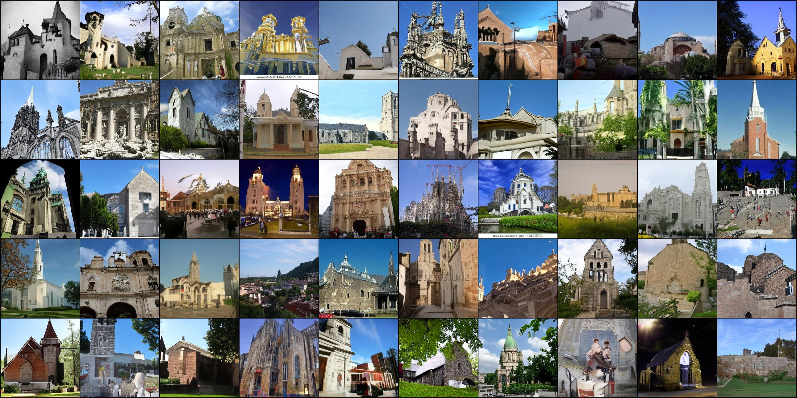
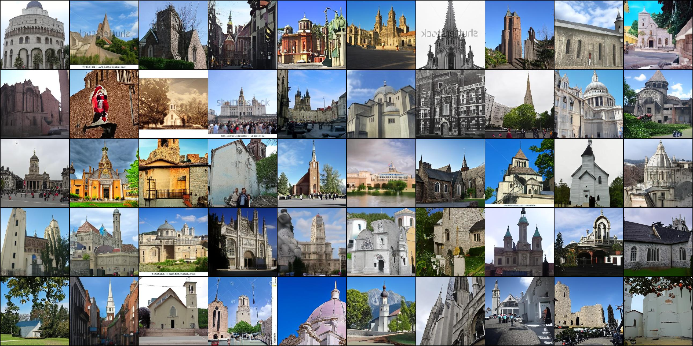
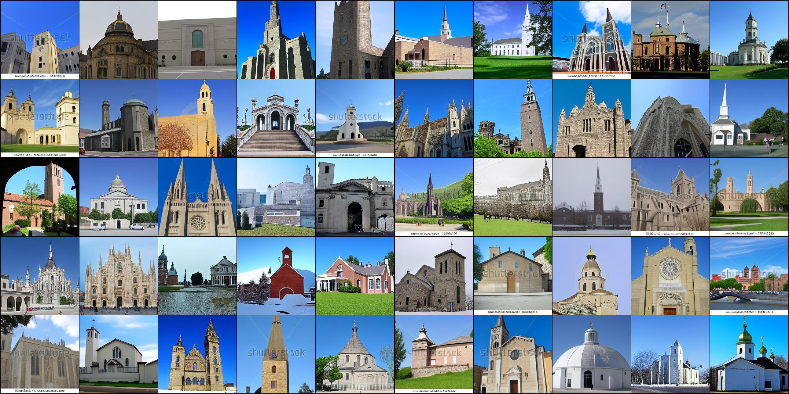

# Bernoulli Diffusion and Denoising

To train a Bernoulli diffusion model on your own dataset with the provided [BAE_C64](https://drive.google.com/drive/folders/1CFlixXLnEHZ0jaRLXLS4d_bJMZwG-Iih?usp=drive_link) binary autoencoder for encoding the images into binary tensors, run:
```
python -m torch.distributed.launch --nproc_per_node=8 --use_env train_sampler_online.py --sampler bld --dataset custom --ema --steps_per_checkpoint 10000 --codebook_size 64 --img_size 256 --steps_per_display_output 5000 --steps_per_save_output 5000 --steps_per_log 100 --total_steps 16 --sample_steps 16 --beta_type linear --amp --train_steps 2000000 --ae_load_dir logs/BAE_C64 --ae_load_step 8100000 --batch_size 64 --latent_shape 1 16 16 --path_to_data /path-to-your-data --log_dir logs/bnl_test --loss_final mean --p_flip --norm_first
```


To train samplers on the LSUN churches and LSUN bedrooms datasets, download the data from their [official link](https://github.com/fyu/lsun) and modify the path in `datasets.yml` accordingly. 
Here we provide a [checkpoint](https://drive.google.com/drive/folders/1wamsJNe9ewOnYxriiyMf4qN6ENUOvbUT?usp=sharing) (FID 4.17 with `--temp 0.9` sampling) trained on the churches dataset with the following command:
```
python -m torch.distributed.launch --nproc_per_node=4 --master_port 12338 --use_env train_sampler_online.py --sampler bld --dataset churches --ema --steps_per_checkpoint 10000 --codebook_size 64 --img_size 256 --steps_per_display_output 5000 --steps_per_save_output 5000 --steps_per_log 100 --total_steps 64 --sample_steps 64 --beta_type linear --amp --train_steps 2000000 --ae_load_dir logs/BAE_C64 --ae_load_step 8100000 --batch_size 64 --latent_shape 1 16 16 --log_dir logs/bnl_churches --loss_final mean --p_flip --norm_first
```

To generate images, run:
```
python gen_imgs.py --sampler bld --dataset churches --ema --codebook_size 64 --img_size 256 --total_steps 64 --sample_steps 64 --beta_type linear --amp --ae_load_dir logs/BAE_C64 --ae_load_step 8100000 --batch_size 50 --latent_shape 1 16 16 --log_dir logs/churches_c64_s64/ --p_flip --norm_first --load_dir logs/churches_c64_s64/ --load_step -1 --temp 0.5
```
with different values of `--temp` for trades-offs between quality and diversity. Here are some examples:

`--temp 1.0`



---

`--temp 0.9`



---

`--temp 0.6`



