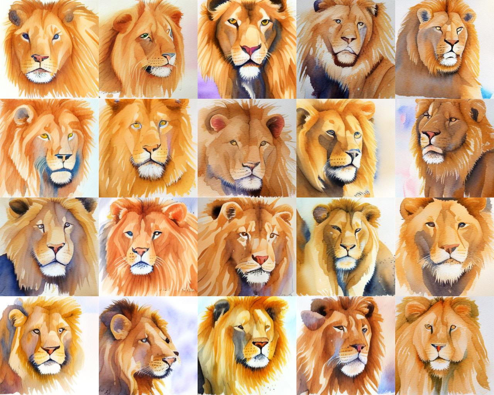
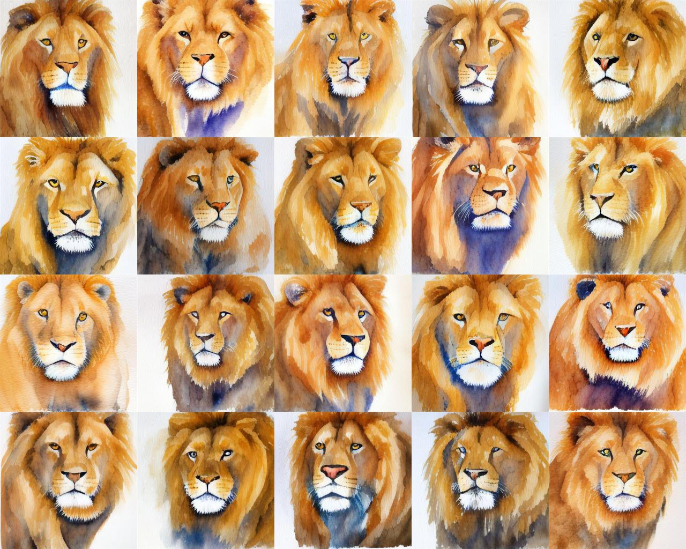
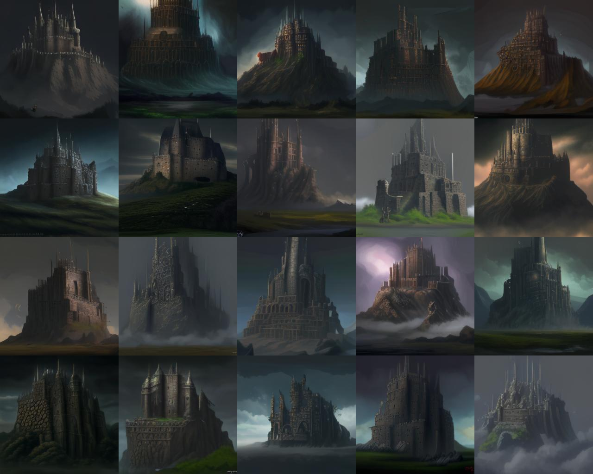

# Demo for text to image generation

The current version is a simple demonstration of using binary latent diffusion for text to image generation. 

We use a pretrained (frozen) CLIP model to extract a single vector representating the text prompt, and feed it to the denoising transformer as an additional token. 
This model was trained using a small (~11M) subset of LAION with high aesthetic scores. 
We are currently training a larger model with more data and cross attention (text -> image) layers. 

To run the text to image generation, first download the models at [this link](https://drive.google.com/drive/folders/1iZvnc7gekN6p0Ommw9lAWdUPQmw3_svH?usp=sharing), and place them under the logs folder. Then run:

```
CUDA_VISIBLE_DEVICES=0 python -m torch.distributed.launch --nproc_per_node=1 --use_env t2i_sampler.py --sampler bld --dataset laion-aes --ema --codebook_size 64 --img_size 256 --ema --total_steps 64 --beta_type linear --bert_n_emb 768 --bert_n_head 12 --bert_n_layers 24 --ae_load_dir logs/BinaryAutoencoder_T2I/ --ae_load_step 3960000 --latent_shape 1 16 16 --norm_first --load_step -1 --load_dir logs/BLD_T2I/ --load_optim --log_dir logs/BLD_T2I/ --batch_size 20 --p_flip --root_path /path-to-clip-models --sample_steps 64 --omega 10.0 --temp 1.0 
```

The downloaded [CLIP](https://github.com/openai/CLIP) models should be placed under `/path-to-clip-models/clip_models`

`--omega` sets the scale of classifier-free guidance, `--temp` sets the scale of temperature. 

Here are some examples:

Promt: A watercolor painting of lion
`--omega 10.0 --temp 1.0`


The generation can be accelerated by skipping denoising steps:
Promt: A watercolor painting of lion
`--omega 10.0 --temp 0.8 --sample_steps 16`



Promt: A huge meta castle
`--omega 10.0 --temp 1.0`
